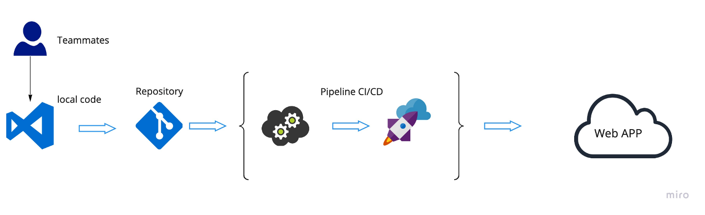

# Price Predictions Process Book

## Create Enviroment

```
pipenv install --python 3.8
```

## Install dependencies

```
pipenv install Cython Flask gunicorn Jinja2 numpy pandas plotly python-dateutil requests scikit-learn matplotlib seaborn jupyter
```

## run Jupyter trust first

```
jupyter trust pp-solutions.ipynb
```

## Run Jupyter notebook

```
jupyter notebook pp-solutions.ipynb
```

## Creation Process



## Web Application Structure


## Process Detailed

- [Model](process-book/model/)
- [Database](process-book/database/)
- [Application](process-book/app/)
- [Cloud Architecture](process-book/aws/)
