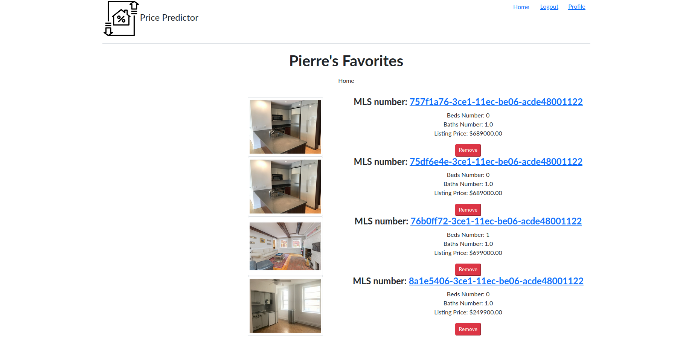

# Price Predictions Web App

- [Price Predictions Web App](#price-predictions-web-app)
  - [Registeration](#registeration)
    - [Register](#register)
    - [Login](#login)
  - [Search](#search)
    - [Search Results](#search-results)
    - [Property Details](#property-details)
  - [Favorites](#favorites)

## Registeration

The Price Prediction app allows user to register themselves as authorized users that let them manage their saved listings.

### Register

The "Register" link at the top takes the guest user to register as a Price Predictor user. This simple form only requires user to enter a username and a password.

### Login

Once a user has registered him/herself, he/she can login and save/review/remove the saved homes.

## Search

This is the main page where user can search for homes using the options provided. ZipCode is required and rest of the fields are optional but preset with default values.

### Search Results

Homes matching the search criteria are displayed once the user hits the search button. The listings are shown with the address and brief highlights.

### Property Details

Details about individual property can be viewed once the user clicks on the address from the search results page. This page displays the pricing and detailed information about the property.

## Favorites

Registered users can mark a property as favorite for future viewing.

