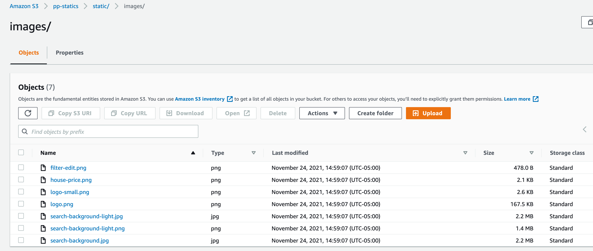

# Price Predictions Cloud Architecture

- [Price Predictions Cloud Architecture](#price-predictions-cloud-architecture)
  - [Network Topology](#network-topology)
  - [AWS Network Configuration](#aws-network-configuration)
    - [Internet Gateway](#internet-gateway)
    - [Virtual private cloud (VPC)](#virtual-private-cloud-vpc)
    - [Subnetworks](#subnetworks)
    - [Relational Database Service](#relational-database-service)
    - [Amazon Simple Storage Service](#amazon-simple-storage-service)
    - [Serverless Platform](#serverless-platform)
  - [Github Actions](#github-actions)
    - [deploy to Lambda](#deploy-to-lambda)
  - [Serverless](#serverless)
    - [Handle session stateless server](#handle-session-stateless-server)
    - [YAML configuration](#yaml-configuration)

## Network Topology

The Price prediction app is a two tier architecture where we use a database tier in a private subnetwork and an aws serverless lambda in a public subnetwork that can connect between the private subnet and internet through gateways.


## AWS Network Configuration

The follow are the configuration of our application architecture.

### Internet Gateway


### Virtual private cloud (VPC)


### Subnetworks


### Relational Database Service


### Amazon Simple Storage Service

Images in S3 Services



### Serverless Platform

AWS Lambda is an event-driven, serverless computing platform


## Github Actions

### deploy to Lambda

```YML
name: AWS Deploy
defaults:
  run:
    working-directory: "./predictions-app"
on: [push]
env:
  AWS_PROFILE: ${{ secrets.AWS_PROFILE }}
  AWS_ACCESS_KEY_ID: ${{ secrets.AWS_ACCESS_KEY_ID }}
  AWS_SECRET_ACCESS_KEY: ${{ secrets.AWS_SECRET_ACCESS_KEY }}
  AWS_DEFAULT_REGION: ${{ secrets.AWS_REGION }}
  SYSTEM_VERSION_COMPAT: ${{ secrets.SYSTEM_VERSION_COMPAT }}
  BUCKET_URI: ${{ secrets.BUCKET_URI}}
jobs:
  test:
    name: test develop
    runs-on: ubuntu-latest
    defaults:
      run:
        working-directory: "./predictions-app"
    env:
      working-directory: "./predictions-app"
    if: github.ref == 'refs/heads/develop'
    steps:
      - uses: actions/checkout@v2
      - name: Set up Python
        uses: actions/setup-python@v2
        with:
          python-version: 3.8
      - name: Install apt-get update
        run: |
          sudo apt-get update
      - name: Install python app
        run: |
          python -m pip install --upgrade pipenv
          pipenv install --deploy
        working-directory: ${{env.working-directory}}
  submit:
    name: Submit to AWS
    runs-on: ubuntu-latest
    defaults:
      run:
        working-directory: "./predictions-app"
    env:
      working-directory: "./predictions-app"
    if: github.ref == 'refs/heads/main'
    steps:
      - uses: actions/checkout@v2
      - name: Set up Python
        uses: actions/setup-python@v2
        with:
          python-version: 3.8
      - name: Configure AWS credentials
        uses: aws-actions/configure-aws-credentials@v1
        with:
          aws-access-key-id: ${{ secrets.AWS_ACCESS_KEY_ID }}
          aws-secret-access-key: ${{ secrets.AWS_SECRET_ACCESS_KEY }}
          aws-region: ${{ secrets.AWS_REGION }}
      - name: Set up Node.js
        uses: actions/setup-node@v1
        with:
          node-version: "12"
      - run: npm install
        working-directory: ${{env.working-directory}}
      - name: Install apt-get update
        run: |
          sudo apt-get update
      - name: Install serverless
        run: |
          npm install serverless -g
        working-directory: ${{env.working-directory}}
      - name: Install awscli
        run: |
          sudo apt-get install awscli
      - name: Install python app
        run: |
          python -m pip install --upgrade pipenv
          pipenv install --deploy
        working-directory: ${{env.working-directory}}
      - name: Set up Docker
        uses: docker-practice/actions-setup-docker@master
      - name: Deploy Python App to AWS Lambda
        run: |
          aws configure set aws_access_key_id ${{ secrets.AWS_ACCESS_KEY_ID }}
          aws configure set aws_secret_access_key ${{ secrets.AWS_SECRET_ACCESS_KEY }}
          aws configure set default.region  ${{ secrets.AWS_REGION }}
          serverless deploy
        working-directory: ${{env.working-directory}}

```

## Serverless

Web App Python is running on a serverless service that runs code in response to events and automatically manages the computing resources required by python app.

### Handle session stateless server

We have to handle the stateless of the lambda by adding a cookie to the serverless

- Login

```python
    session["username"] = username
    response = make_response(redirect(url_for("index")))
    response.set_cookie('username', session["username"])
    print('cookie login pass:', request.cookies.get('username'))
```

- Logout

```python
    response = make_response(redirect(url_for("index")))
    response.set_cookie('username', '', expires=0)
    session.clear()
```

- Navigation

```python
    print('cookie:', request.cookies.get('username'))
    username_value = session['username'] if 'username' in session else request.cookies.get('username')
    if username_value  is not None:
```

### YAML configuration

```YML
service: serverless-flask-pp-app
frameworkVersion: "2 || 3"

plugins:
  - serverless-python-requirements
  - serverless-apigwy-binary
  - serverless-prune-plugin
  - serverless-wsgi

custom:
  apigwBinary:
    types:
      - "image/jpeg"
      - "image/png"
  prune:
    automatic: true
    number: 3
  pythonRequirements:
    slim: true
    strip: false
    zip: true
  scriptable:
    hooks:
      after:package:createDeploymentArtifacts:
        - ./shake.sh
  tableName: "properties"
  wsgi:
    app: routes.app
    packRequirements: false

provider:
  name: aws
  runtime: python3.8
  stage: dev
  region: us-east-1
  lambdaHashingVersion: 20201221
  environment:
    PROPERTIES_TABLE: "properties"
    USERS_TABLE: "users"
    POSTGRES_HOST:
    POSTGES_DATABASE_URI: ""
    POSTGRES_DB: ""
    POSTGRES_USER: "postgres"
    POSTGRES_PASSW: ""
    POSTGRES_PORT: "5432"
  exclude:
    - .git/**
    - .vscode/**
    - node_modules/**
    - venv/**
  iamRoleStatements:
    - Effect: "Allow"
      Action:
        - ec2:CreateNetworkInterface
        - ec2:DescribeNetworkInterfaces
        - ec2:DeleteNetworkInterface
      Resource: "*"

functions:
  app:
    handler: wsgi_handler.handler
    events:
      - http: ANY /
        contentHandling: CONVERT_TO_BINARY
      - http: POST /predict
      - http: POST /logout
      - http: ANY {proxy+}
        contentHandling: CONVERT_TO_BINARY

```
