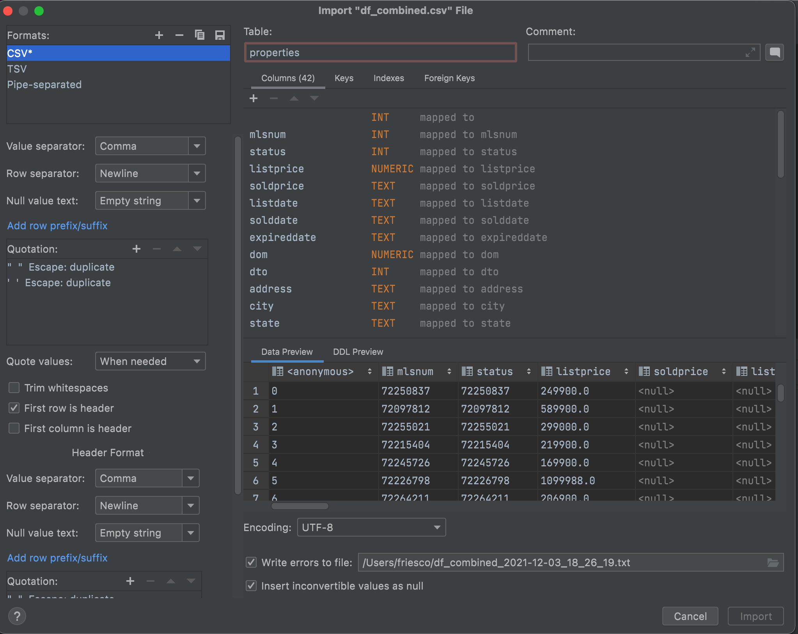
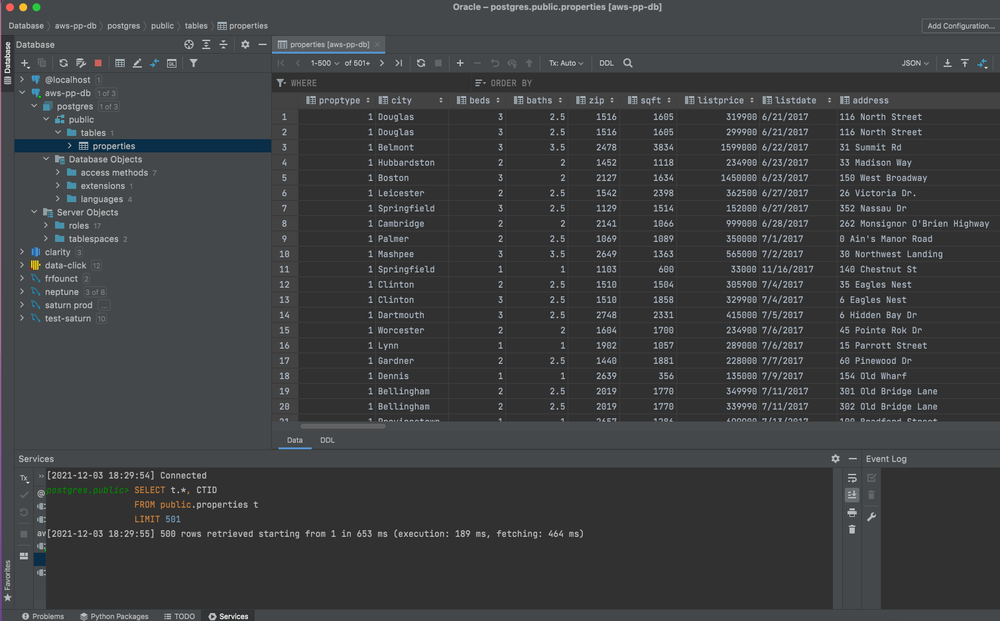

# Price Predictions Database

- [Price Predictions Database](#price-predictions-database)
  - [Create Properties table](#create-properties-table)
  - [table structure](#table-structure)
  - [Table Optimization](#table-optimization)
  - [Users table](#users-table)
  - [Properties Table Query](#properties-table-query)
  - [Query Sample](#query-sample)

## Create Properties table

Properties table was created from the CSV file

```python
df_combined.to_csv('df_combined.csv', sep=',', encoding='utf-8')
```



## table structure

```SQL
create table properties
(
    row_id                 text,
    soldprice              text,
    listdate               text,
    listprice              numeric,
    expireddate            text,
    dom                    numeric,
    dto                    integer,
    address                text,
    city                   text,
    state                  text,
    zip                    integer,
    solddate               text,
    beds                   integer,
    baths                  numeric,
    sqft                   integer,
    age                    integer,
    lotsize                integer,
    agentname              text,
    officename             text,
    officephone            text,
    showinginstructions    text,
    area                   integer,
    style                  text,
    level                  integer,
    garage                 integer,
    heating                text,
    cooling                text,
    elementaryschool       text,
    juniorhighschool       text,
    highschool             text,
    remarks                text,
    proptype               integer,
    streetname             text,
    housenum1              text,
    housenum2              numeric,
    photourl               text,
    otherfeatures          text,
    hasotherfeatures       integer,
    hasproptype            integer,
    hasstreetname          integer,
    hashousenum1           integer,
    hashousenum2           integer,
    hasagentname           integer,
    hasofficename          integer,
    hasofficephone         integer,
    hasshowinginstructions integer,
    hasstyle               integer,
    haslevel               integer,
    hasgarage              integer,
    hasheating             integer,
    hascooling             integer,
    haselementaryschool    integer,
    hasjuniorhighschool    integer,
    hashighschool          integer,
    haslistprice           integer,
    haslistdate            integer,
    hasaddress             integer,
    hascity                integer,
    hasstate               integer,
    hasarea                integer,
    proptype_str           text,
    zip_str                text
);
```

## Table Optimization

```SQL
ALTER TABLE properties ADD PRIMARY KEY (row_id);

CREATE INDEX search_price ON properties (listprice, zip, photourl);
CREATE INDEX search_price1 ON properties ( zip, photourl);
CREATE INDEX search_price2 ON properties (listprice, zip);
CREATE INDEX search_price3 ON properties (listprice,  photourl);

```

## Users table

```SQL
create table users
(
    uid      serial
        constraint users_pkey
            primary key,
    username text not null,
    password text not null
);
```

## Properties Table Query



## Query Sample

```python
zipcode = 2053
beds = 3
baths = 2.0
sqft = 200
proptype = 1
hasotherfeatures = 1
hasproptype = 1
hasstreetname = 1
hashousenum1 = 0
hashousenum2 = 1
hasagentname = 1
hasofficename = 1
hasofficephone = 1
hasshowinginstructions = 1
hasstyle = 1
haslevel = 1
hasgarage = 1
hasheating = 1
hascooling = 0
haselementaryschool = 0
hasjuniorhighschool = 0
hashighschool = 0
haslistprice = 1
haslistdate = 0
hasaddress = 1
hascity = 1
hasstate = 1
hasarea = 1


query = (
    "select * from properties where 1=1 and "
    "zip = {zipcode} and beds ={beds} and baths = {baths} and sqft = {sqft} and proptype = {proptype} and hasotherfeatures = {hasotherfeatures} and "
    "hasproptype = {hasproptype} and hasstreetname = {hasstreetname} and hashousenum1 = {hashousenum1} and hashousenum2 = {hashousenum2} and "
    "hasagentname = hasagentname and hasofficename = hasofficename and hasofficephone = hasofficephone and hasshowinginstructions = hasshowinginstructions"
    " and hasstyle = {hasstyle} and haslevel = {haslevel} and hasgarage = {hasgarage} and hasheating = {hasheating} and hascooling = {hascooling} and "
    "haselementaryschool = {haselementaryschool} and hasjuniorhighschool = {hasjuniorhighschool} and "
    "hashighschool = {hashighschool} and haslistprice = {haslistprice} and haslistdate = {haslistdate} and hasaddress = {hasaddress} and "
    "hascity = {hascity} and hasstate = {hasstate} and hasarea = {hasarea}".format(
        zipcode=zipcode,
        beds=beds,
        baths=baths,
        sqft=sqft,
        proptype=proptype,
        hasotherfeatures=hasotherfeatures,
        hasproptype=hasproptype,
        hasstreetname=hasstreetname,
        hashousenum1=hashousenum1,
        hashousenum2=hashousenum2,
        hasagentname=hasagentname,
        hasofficename=hasofficename,
        hasofficephone=hasofficephone,
        hasshowinginstructions=hasshowinginstructions,
        hasstyle=hasstyle,
        haslevel=haslevel,
        hasgarage=hasgarage,
        hasheating=hasheating,
        hascooling=hascooling,
        haselementaryschool=haselementaryschool,
        hasjuniorhighschool=hasjuniorhighschool,
        hashighschool=hashighschool,
        haslistprice=haslistprice,
        haslistdate=haslistdate,
        hasaddress=hasaddress,
        hascity=hascity,
        hasstate=hasstate,
        hasarea=hasarea,
    )
)


```
