# Price Predictions Model

- [Price Predictions Model](#price-predictions-model)
  - [Reference](#reference)
  - [Dataset cleaning](#dataset-cleaning)
    - [Merge dataset](#merge-dataset)
    - [Load dataset](#load-dataset)
    - [Column List](#column-list)
    - [Dataset Description](#dataset-description)
    - [Dataset dimensions](#dataset-dimensions)
    - [Join Train and test](#join-train-and-test)
    - [Create Binary Variables for Open Answers](#create-binary-variables-for-open-answers)
    - [New List of columns](#new-list-of-columns)
    - [Convert Columns ot respective numeric values and fill null with zeroes](#convert-columns-ot-respective-numeric-values-and-fill-null-with-zeroes)
    - [Create a new dataset csv](#create-a-new-dataset-csv)
    - [Drop to all not numeric columns](#drop-to-all-not-numeric-columns)
    - [Only Numerical columns](#only-numerical-columns)
  - [Visualization](#visualization)
    - [List Price](#list-price)
    - [Beds](#beds)
    - [Baths](#baths)
    - [Plots](#plots)
      - [Beds vs List Price top 100](#beds-vs-list-price-top-100)
      - [Baths vs List Price top 100](#baths-vs-list-price-top-100)
      - [Beds vs List Price](#beds-vs-list-price)
      - [Baths vs List Price](#baths-vs-list-price)
      - [SQFT vs List Price](#sqft-vs-list-price)
    - [Beds vs Proptype vs Listprice](#beds-vs-proptype-vs-listprice)
    - [Baths vs Proptype vs Listprice](#baths-vs-proptype-vs-listprice)
  - [Boxplot](#boxplot)
    - [Boxplot List Price](#boxplot-list-price)
    - [Boxplot Beds](#boxplot-beds)
    - [Boxplot Baths](#boxplot-baths)
    - [Boxplot SQFT](#boxplot-sqft)
  - [Histogram](#histogram)
    - [Beds Histogram](#beds-histogram)
    - [Baths Histogram](#baths-histogram)
  - [Model Analysis](#model-analysis)
    - [Linear Regression](#linear-regression)
    - [Random forest](#random-forest)
    - [Model Tested](#model-tested)

## Reference

[Jupyter Notebook](https://github.com/Fr4nc3/predictions_housing/pp-solutions.ipynb)

## Dataset cleaning

### Merge dataset

```bash
head -1 train/CON__OCT_2016.csv > train.csv
tail -n +2  train/*.csv >> train.csv

head -1 test/test_CON_Jan_2018.csv > test.csv
tail -n +2  test/*.csv >> test.csv
```

### Load dataset

```python
# Load data from CSV
train_dataset = pd.read_csv("static/data/train.csv", dtype={'zip':'category', 'mlsnum':'string', 'proptype':'string'})
test = pd.read_csv("static/data/test.csv",  dtype={'zip':'category', 'mlsnum':'string','proptype':'string'})

train_dataset.head()
```

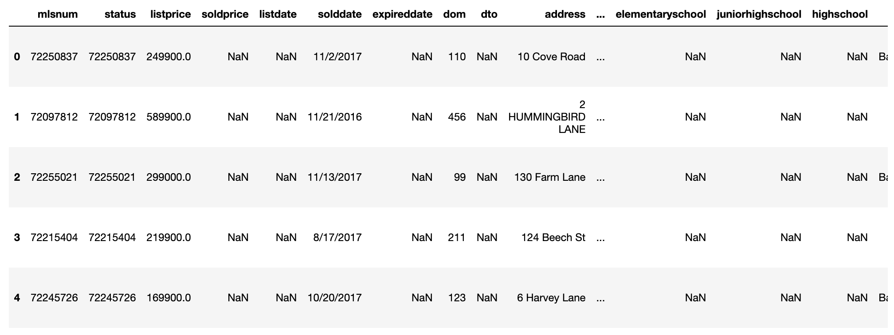

### Column List

```python
['otherfeatures', 'status', 'solddate', 'city', 'showinginstructions', 'garage', 'address', 'agentname', 'listdate', 'cooling', 'dom', 'soldprice', 'level', 'housenum1', 'mlsnum', 'baths', 'officename', 'style', 'expireddate', 'area', 'elementaryschool', 'zip', 'sqft', 'officephone', 'listprice', 'beds', 'highschool', 'heating', 'juniorhighschool', 'dto', 'age', 'remarks', 'photourl', 'row_id', 'proptype', 'state', 'streetname', 'housenum2', 'lotsize']
```

### Dataset Description

```python
train.describe()
test.describe()
```

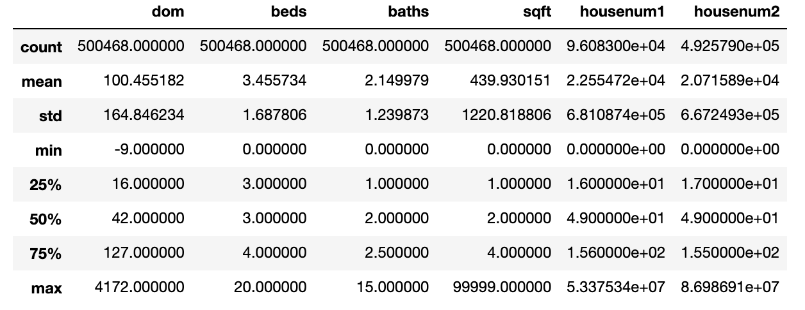

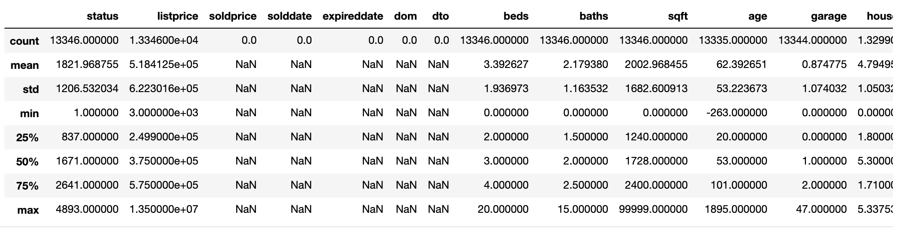

### Dataset dimensions

```python
train_dataset.shape, test.shape
# ((500468, 39), (13346, 39))

```

### Join Train and test

```python
train_dataset.index = train_dataset['row_id']
test.index = test['row_id']
frames = [train_set, test]
df_combined = pd.concat(frames)
df_combined = df_combined.reset_index(drop=True)
df_combined.shape
# (513814, 39)

```

### Create Binary Variables for Open Answers

```python
df_combined['hasotherfeatures'] = np.where(df_combined['otherfeatures'].isnull(), 0, 1)
df_combined['hasproptype'] = np.where(df_combined['proptype'].isnull(), 0, 1)
df_combined['hasstreetname'] = np.where(df_combined['streetname'].isnull(), 0, 1)
df_combined['hashousenum1'] = np.where(df_combined['housenum1'].isnull(), 0, 1)
df_combined['hashousenum2'] = np.where(df_combined['housenum2'].isnull(), 0, 1)

df_combined['hasagentname'] = np.where(df_combined['agentname'].isnull(), 0, 1)
df_combined['hasofficename'] = np.where(df_combined['officename'].isnull(), 0, 1)
df_combined['hasofficephone'] = np.where(df_combined['officephone'].isnull(), 0, 1)
df_combined['hasshowinginstructions'] = np.where(df_combined['showinginstructions'].isnull(), 0, 1)
df_combined['hasstyle'] = np.where(df_combined['style'].isnull() , 0, 1)
df_combined['haslevel'] = np.where(df_combined['level'].isnull(), 0, 1)

df_combined['hasgarage'] = np.where(df_combined['garage'].isnull(), 0, 1)
df_combined['hasheating'] = np.where(df_combined['heating'].isnull(), 0, 1)
df_combined['hascooling'] = np.where(df_combined['cooling'].isnull(), 0, 1)
df_combined['haselementaryschool'] = np.where(df_combined['elementaryschool'].isnull(), 0, 1)
df_combined['hasjuniorhighschool'] = np.where(df_combined['juniorhighschool'].isnull(), 0, 1)
df_combined['hashighschool'] = np.where(df_combined['highschool'].isnull(), 0, 1)

df_combined['haslistprice'] = np.where(df_combined['listprice'].isnull(), 0, 1)
df_combined['haslistdate'] = np.where(df_combined['listdate'].isnull(), 0, 1)
df_combined['hasaddress'] = np.where(df_combined['address'].isnull(), 0, 1)
df_combined['hascity'] = np.where(df_combined['city'].isnull(), 0, 1)
df_combined['hasstate'] = np.where(df_combined['state'].isnull(), 0, 1)
df_combined['hasarea'] = np.where(df_combined['area'].isnull(), 0, 1)

```

### New List of columns

```Python
df_combined.columns

Index(['mlsnum', 'status', 'listprice', 'soldprice', 'listdate', 'solddate',
       'expireddate', 'dom', 'dto', 'address', 'city', 'state', 'zip', 'area',
       'beds', 'baths', 'sqft', 'age', 'lotsize', 'agentname', 'officename',
       'officephone', 'showinginstructions', 'remarks', 'style', 'level',
       'garage', 'heating', 'cooling', 'elementaryschool', 'juniorhighschool',
       'highschool', 'otherfeatures', 'proptype', 'streetname', 'housenum1',
       'housenum2', 'photourl', 'row_id', 'hasotherfeatures', 'hasproptype',
       'hasstreetname', 'hashousenum1', 'hashousenum2', 'hasagentname',
       'hasofficename', 'hasofficephone', 'hasshowinginstructions', 'hasstyle',
       'haslevel', 'hasgarage', 'hasheating', 'hascooling',
       'haselementaryschool', 'hasjuniorhighschool', 'hashighschool',
       'haslistprice', 'haslistdate', 'hasaddress', 'hascity', 'hasstate',
       'hasarea'],
      dtype='object')
```

### Convert Columns ot respective numeric values and fill null with zeroes

```Python
df_combined['listprice'] =  df_combined['listprice'].replace(',','', regex=True).astype(float)
df_combined['listprice'] = df_combined['listprice'].astype('float32')
df_combined['baths'] = df_combined['baths'].astype('float32')
df_combined['beds'] = df_combined['beds'].astype('int')

df_combined['city'] = df_combined['city'].astype('string')
df_combined['state'] = df_combined['state'].astype('string') # category
df_combined['photourl'] = df_combined['photourl'].astype('string')
df_combined['zip'] = df_combined['zip'].astype('string')
df_combined.city.fillna("00000", inplace=True)
df_combined.zip.fillna("00000", inplace=True)
df_combined.state.fillna("NA", inplace=True)
df_combined.photourl.fillna("NA", inplace=True)
# keep these variables as original string for csv export
df_combined['proptype_str'] = df_combined['proptype'].astype('string')
df_combined['zip_str'] =  df_combined['zip'].astype('string')

df_combined['listprice'] = pd.to_numeric(df_combined['listprice'], errors='ignore')
df_combined['beds'] = pd.to_numeric(df_combined['beds'], errors='ignore')
df_combined['baths'] = pd.to_numeric(df_combined['baths'], errors='ignore')
df_combined['sqft'] = pd.to_numeric(df_combined['sqft'], errors='ignore')
df_combined['zip'] = pd.to_numeric(df_combined['zip'], errors='ignore')

df_combined.listprice.fillna(0, inplace=True)
df_combined.zip.fillna(0, inplace=True)
df_combined.sqft.fillna(0, inplace=True)
df_combined.beds.fillna(0, inplace=True)
df_combined.baths.fillna(0, inplace=True)

df_combined.loc[df_combined.proptype == 'CC', 'proptype'] = '1'
df_combined.loc[df_combined.proptype == 'MF', 'proptype'] = '2'
df_combined.loc[df_combined.proptype == 'SF', 'proptype'] = '3'
df_combined.loc[df_combined.proptype == 'EXT', 'proptype'] = '4'
df_combined[df_combined.eq('00nan').any(1)]
df_combined.loc[df_combined['zip'] == '00nan', ['zip']] = 0
df_combined.loc[df_combined['zip'] == 'Centerville', ['zip']] = 0
df_combined['proptype'] = df_combined['proptype'].astype('int')

```

### Create a new dataset csv

- This will be used to create the database

```python
df_combined.to_csv('df_combined.csv', sep=',', encoding='utf-8')
```

### Drop to all not numeric columns

```python
new_drop_columns = [ 'status','listdate', 'address','area',
                    'agentname','officename', 'officephone',
                    'showinginstructions', 'remarks', 'style',
                    'level', 'garage', 'heating', 'cooling',
                    'elementaryschool', 'juniorhighschool',
                    'highschool', 'otherfeatures', 'streetname',
                    'housenum1', 'housenum2', 'mlsnum', 'soldprice', 'solddate',
                   'dom', 'dto', 'expireddate', 'age', 'lotsize',
                    'mlsnum', 'row_id', 'proptype_str', 'zip_str',  'city','state', 'photourl']
df_combined.drop(new_drop_columns, axis=1, inplace=True)
```

### Only Numerical columns

```python
Index(['listprice', 'zip', 'beds', 'baths', 'sqft', 'proptype',
       'hasotherfeatures', 'hasproptype', 'hasstreetname', 'hashousenum1',
       'hashousenum2', 'hasagentname', 'hasofficename', 'hasofficephone',
       'hasshowinginstructions', 'hasstyle', 'haslevel', 'hasgarage',
       'hasheating', 'hascooling', 'haselementaryschool',
       'hasjuniorhighschool', 'hashighschool', 'haslistprice', 'haslistdate',
       'hasaddress', 'hascity', 'hasstate', 'hasarea'],
      dtype='object')
```

## Visualization

### List Price

The column `ListPrice` is our target variable or dependent variable and all the other columns are our independent variable.

- Minimum price: $1,000.00
- Maximum price: $90,000,000.00
- Mean price: $631,906.00
- Median price $415,900.00
- Standard deviation of prices: $1,073,829.25
- First quartile of prices: $269,900.00
- Second quartile of prices: $654,900.00
- Interquartile (IQR) of prices: $385,000.00

### Beds

The column `beds` is one of the independents variables

- Minimum beds: 0.00
- Maximum beds: 20.00
- Mean beds: 3.45
- Median beds 3.00
- Standard deviation of beds: 1.69
- First quartile of beds: 3.00
- Second quartile of beds: 4.00
- Interquartile (IQR) of beds: 1.00

### Baths

The column `baths` is one of the independets variables

- Minimum baths: 0.00
- Maximum baths: 15.00
- Mean baths: 2.15
- Median baths 2.00
- Standard deviation of baths: 1.24
- First quartile of baths: 1.00
- Second quartile of baths: 2.50
- Interquartile (IQR) of baths: 1.50

### Plots

#### Beds vs List Price top 100

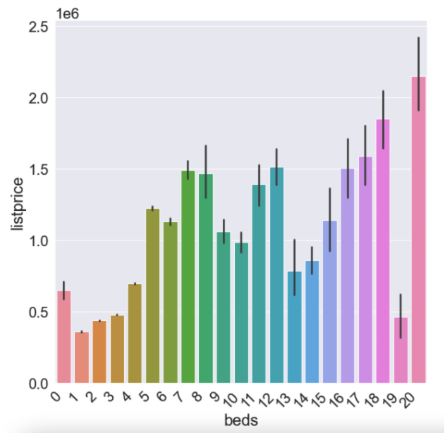

#### Baths vs List Price top 100

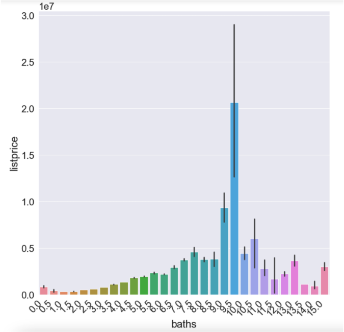

#### Beds vs List Price

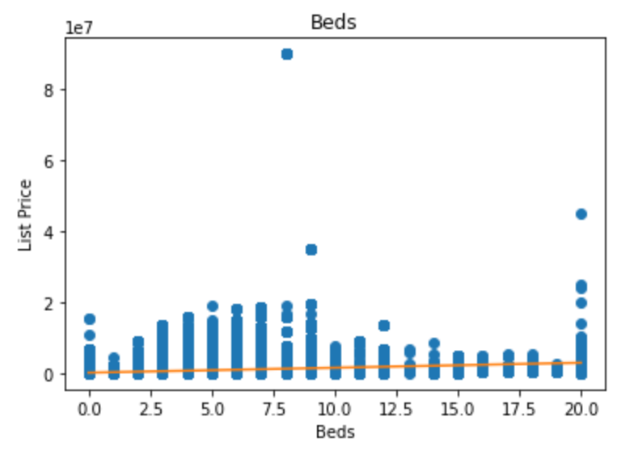

#### Baths vs List Price

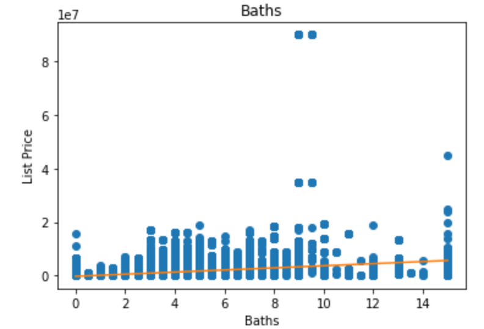

#### SQFT vs List Price

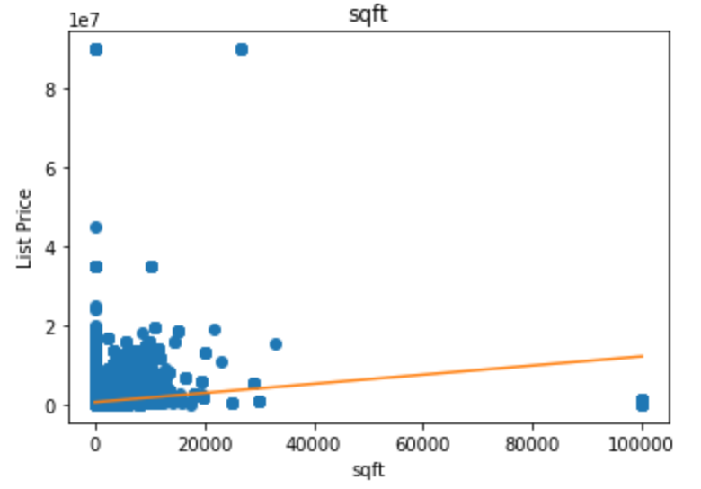

### Beds vs Proptype vs Listprice

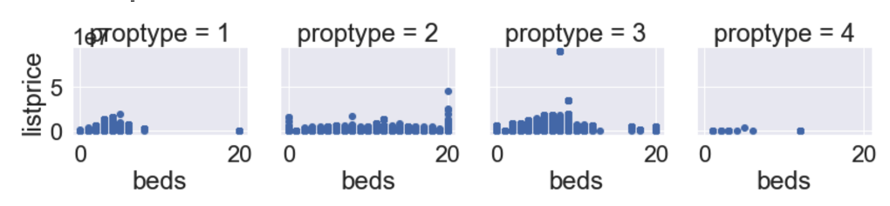

### Baths vs Proptype vs Listprice

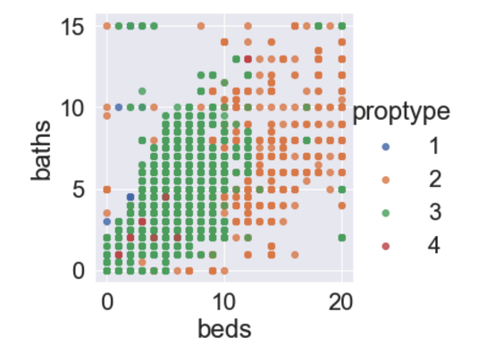

## Boxplot

### Boxplot List Price

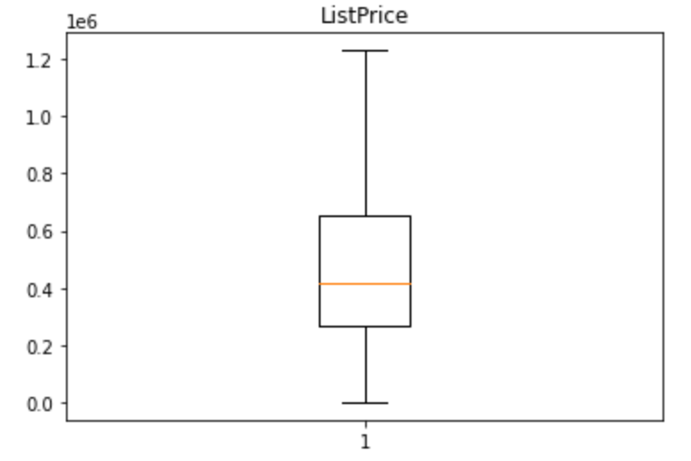

### Boxplot Beds

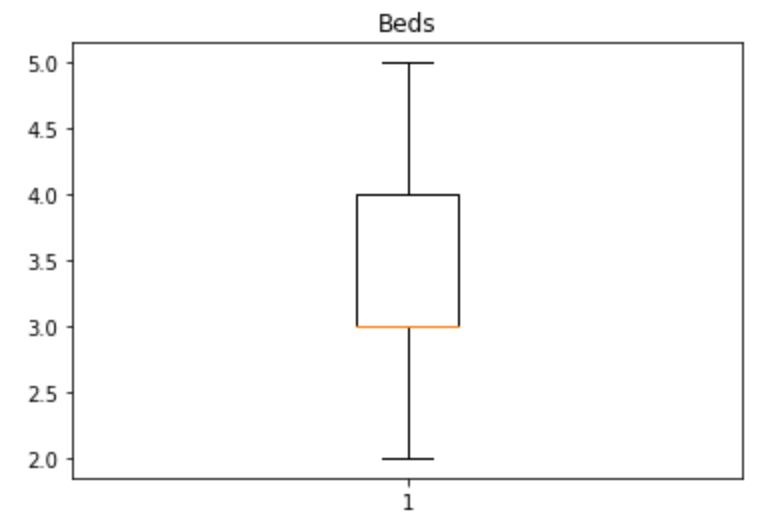

### Boxplot Baths

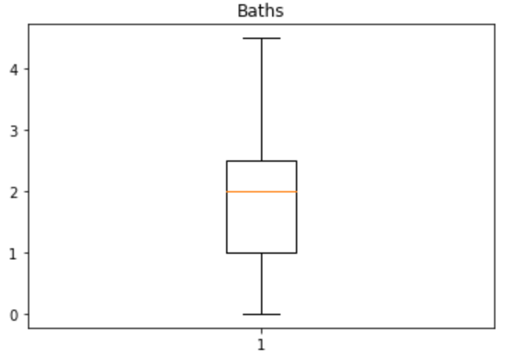

### Boxplot SQFT

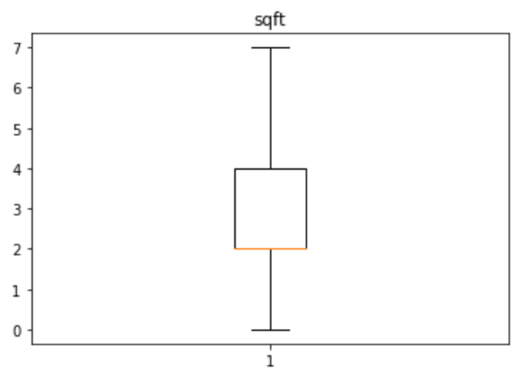

## Histogram

### Beds Histogram

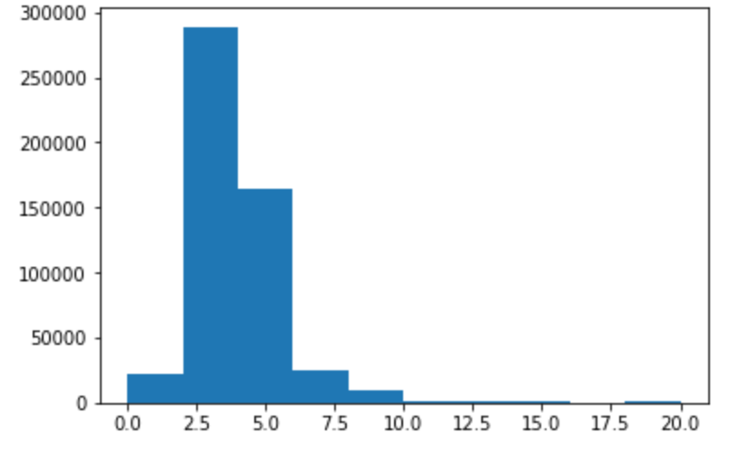

### Baths Histogram

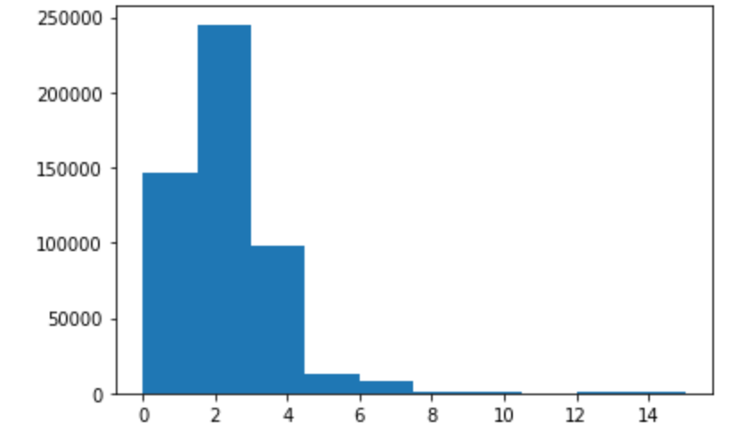

## Model Analysis

We try Linear Regression and Random Forest as base model to analyze our dataset

### Linear Regression

Due to the regressive predictive nature of The Price Prediction Project, we decided to approach our model methodology with a Linear Regression base model.
R-squared is a measure of how well a linear regression model “fits” a dataset. In our output of the regression results, we see that R2 = 0.25. This indicates that 25% of the variance in the number of Price Prediction can be explained by the population size. In many cases, with a 26% or above values indicate high effect size. In this respect, our models are low and medium effect sizes.

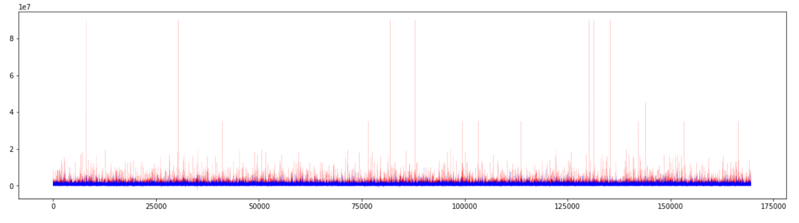

### Random forest

Run RandomForestRegressor with best params from the linear regression. In our output of the Random forest results, we see that R2 = -0.23 which means our model is having a very low R2 in general. This is not too surprising to see from a random forest in particular which loves to fit the training set extremely well due to how exhaustive the algorithm.

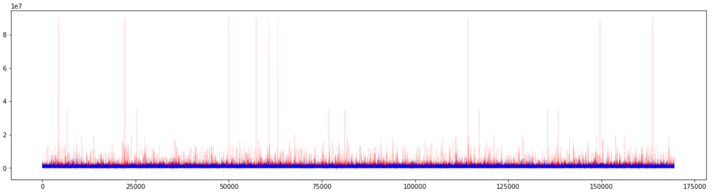

### Model Tested

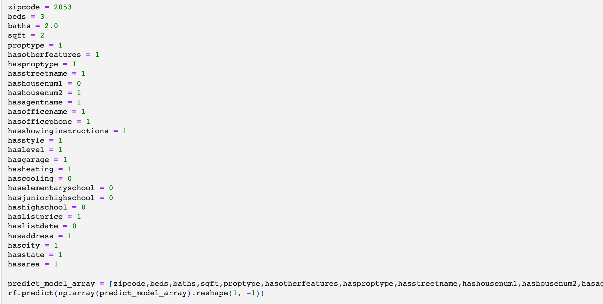

```python

array([557572.21951763])

```
